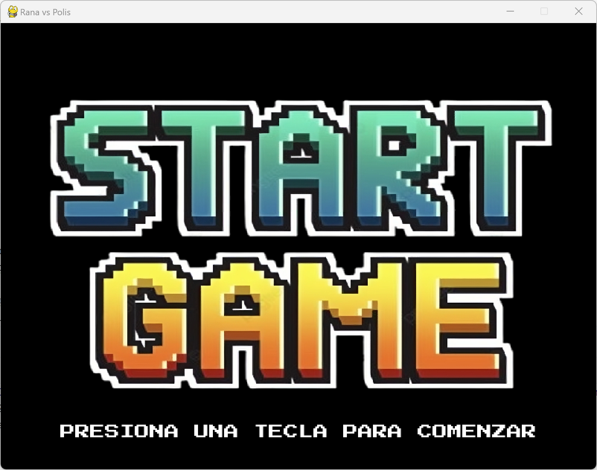
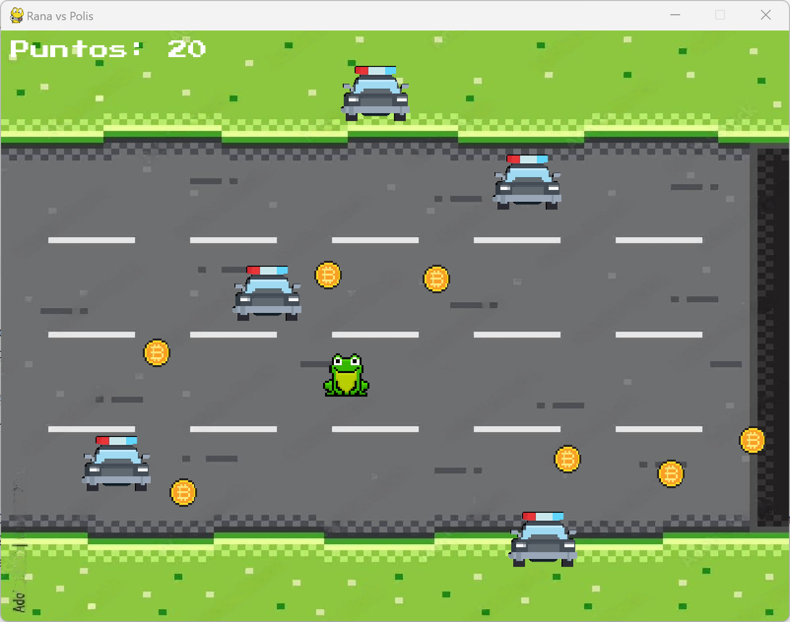
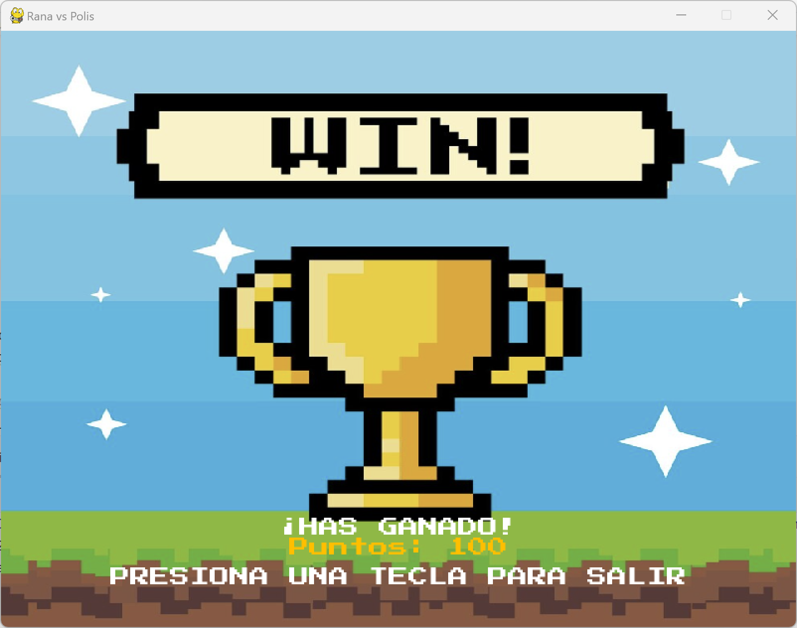
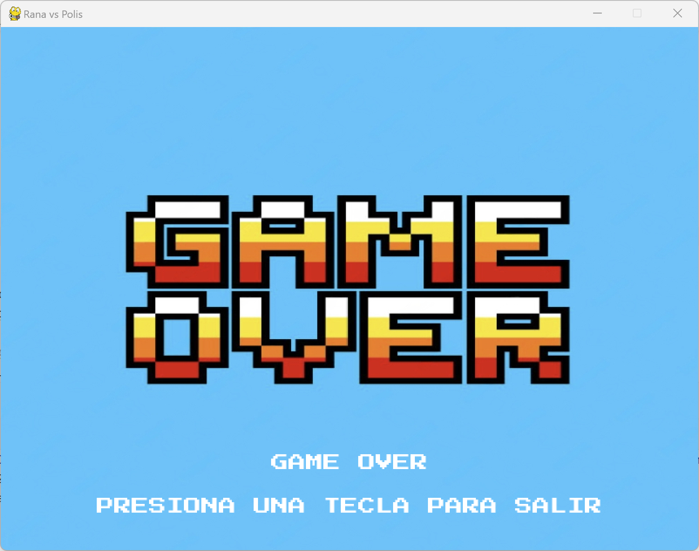
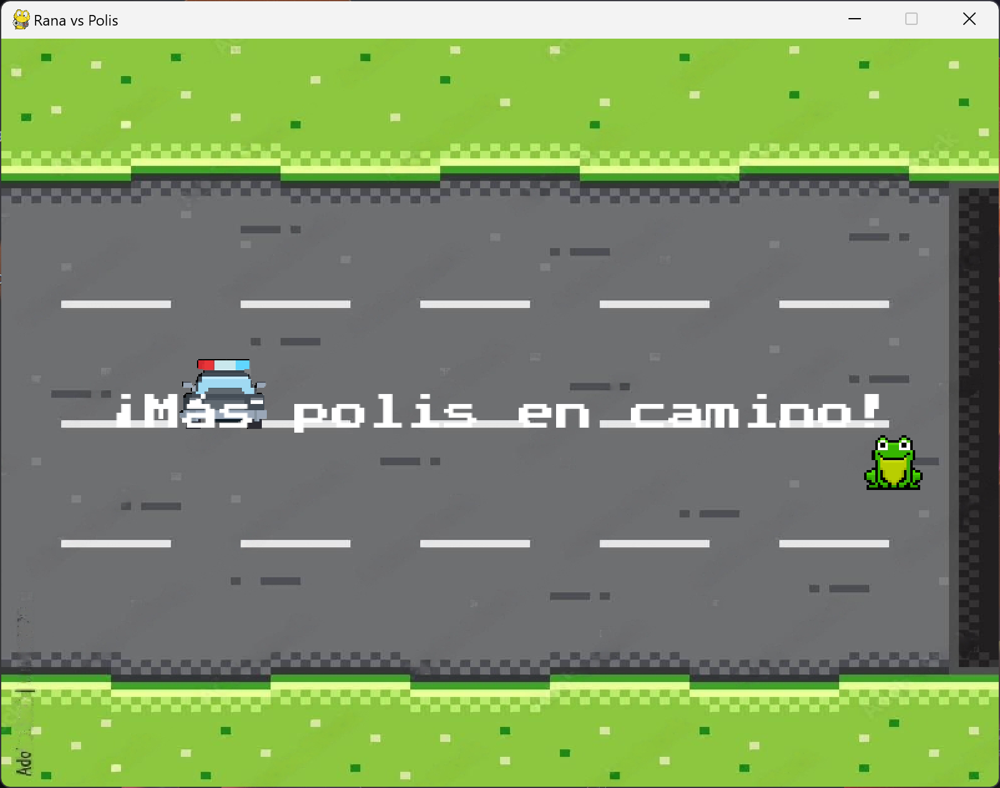

# 24-25-python-game-LynAguayo
24-25-python-game-LynAguayo created by GitHub Classroom

# Rana vs Polis 

**Descripción del juego**  
"Rana vs Polis" es un juego en el que controlas a una rana que es perseguida por coches de policía. El objetivo es acumular la mayor cantidad de monedas posible, pero hay que tener cuidado, ya que si los coches te atrapan, perderás todas las monedas que hayas recogido hasta ese momento. Depende de ti decidir cuándo retirarte a la otra acera para llevarte las monedas, o arriesgarte a quedarte más tiempo, pero con el riesgo de que más coches aparecerán. Cuanto más avaricioso seas, más difícil será el juego.

---

## Mecánica del juego

1. **Control de la rana**:  
   - Usa las teclas de flechas para mover a la rana:
     - **Flecha arriba**: mover hacia arriba.
     - **Flecha abajo**: mover hacia abajo.
     - **Flecha izquierda**: mover hacia la izquierda.
     - **Flecha derecha**: mover hacia la derecha.

2. **Objetivo**:  
   - El objetivo del juego es recoger bitcoins mientras esquivas los coches de policía que te persiguen. Si eres atrapado por un coche, perderás todas las monedas que hayas recogido hasta ese momento.
   - Si decides retirarte y cruzas a la otra acera, las monedas que hayas recogido serán aseguradas, pero si decides quedarte más tiempo, más coches de policía aparecerán, aumentando el riesgo.

3. **Aumento de dificultad**:  
   - Cada vez que consigas 100 puntos, la dificultad aumenta. Esto se traduce en que aparecerán **más coches de policía** y la velocidad con la que se desplazan también aumentará.

4. **Condiciones de victoria y derrota**:  
   - El juego termina cuando la rana es atrapada por un coche. En ese momento, se reproduce el sonido de pérdida y se muestra una pantalla de "GAME OVER" con tus puntos obtenidos.
   - Si logras recoger todas las monedas sin ser atrapado y cruzas a la otra acera, ganas y verás tu puntaje final en la pantalla de victoria.

---

## Pantallas del juego

### Pantalla de inicio:

- **Descripción**: La pantalla de inicio muestra el mensaje **"PRESIONA UNA TECLA PARA COMENZAR"**. Es la primera pantalla que verás al iniciar el juego.

### Pantalla de juego:

- **Descripción**: Esta es la pantalla principal del juego, donde puedes ver la rana, los coches de policía y las monedas. Aquí es donde se desarrollan todas las acciones del juego.

### Pantalla de victoria:

- **Descripción**: Se muestra cuando el jugador completa el objetivo de llegar a la otra acera con todas las monedas, sin ser atrapado por los coches.

### Pantalla de "Game Over":

- **Descripción**: Esta pantalla se muestra cuando el jugador es atrapado por un coche. El juego termina y se queda sin las monedas.

### Pantalla de Nivel Avanzado:

- **Descripción**: Cuando el jugador alcanza los 100 puntos, aparece esta pantalla que indica que la dificultad ha aumentado, con más coches y mayor velocidad.

---

## Sonidos en el juego

1. **Sonido de música de fondo**:  
   Durante todo el juego se reproduce música de fondo para ambientar la experiencia.

2. **Sonido de monedas**:  
   Cada vez que el jugador recoge una moneda, suena el efecto **getCoin.wav**, indicando que ha ganado puntos.

3. **Sonido de perder**:  
   Si el jugador es atrapado por un coche, suena **perder.wav**, indicando que el juego ha terminado.

4. **Sonido de ganar**:  
   Si el jugador consigue completar el objetivo de llegar a la otra acera con las monedas sin ser atrapado, suena **ganar.wav**.

5. **Sonido de dificultad**:  
   Cada vez que el jugador llega a 100 puntos, suena el **newLevel.wav** para indicar que la dificultad ha subido, y más coches aparecerán en la pantalla.

---

## Cómo funciona el juego

1. **Inicio**:  
   Al iniciar el juego, verás la pantalla de inicio con la imagen que te invita a presionar una tecla para comenzar. Al hacerlo, se reproducirá un sonido que te dará la bienvenida al juego.

2. **Recoger monedas**:  
   Las monedas aparecerán aleatoriamente en la pantalla. Cuando la rana se encuentre con una de ellas, obtendrá **10 puntos**. Cuanto más rápido recojas las monedas, más puntos acumularás.

3. **Evitar los coches**:  
   Los coches de policía aparecerán desde la parte superior de la pantalla y se moverán hacia abajo. Si la rana toca un coche, el juego termina y verás la pantalla de "GAME OVER".

4. **Aumento de dificultad**:  
   Cada vez que el jugador alcance los 100 puntos, los coches aparecerán más rápido y en mayor cantidad. El sonido **newLevel.wav** se reproducirá para indicar que la dificultad ha subido.

